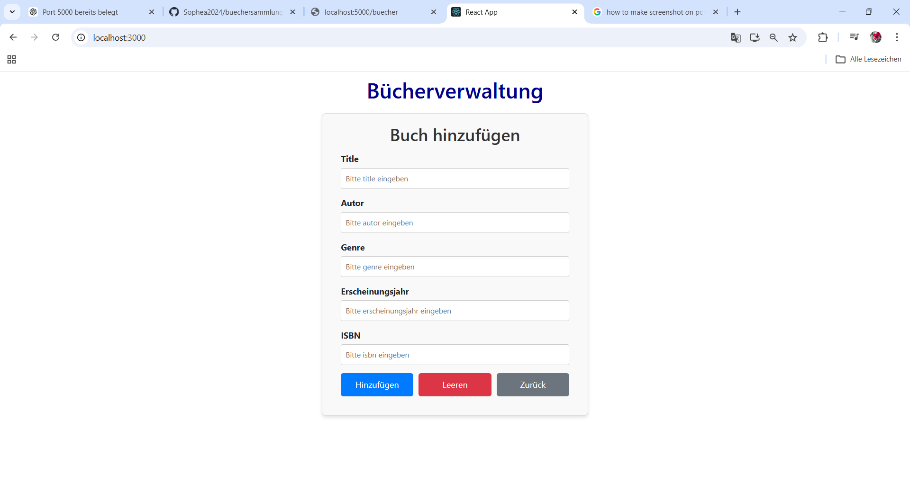

# Büchersammlung – Fullstack Web App

Eine moderne Fullstack-Webanwendung zur Verwaltung einer Büchersammlung.  
Das Projekt besteht aus einem React-Frontend, einem Node.js/Express-Backend und einer MySQL-Datenbank, die über Docker betrieben wird.

---

## Features

- Bücher anzeigen (Liste)
- Bücher hinzufügen
- Bücher bearbeiten (Update Funktion)
- Bücher löschen
- Automatisches Refresh der Daten
- REST API mit Express
- MySQL Datenbank Integration
- Docker Setup für einfache Entwicklung

---

## Tech Stack

### Frontend
- React
- JavaScript
- HTML / CSS
- Axios

### Backend
- Node.js
- Express.js
- mysql2

### Datenbank
- MySQL

### DevOps
- Docker
- Docker Compose

---

## REST API Endpoints

| Methode | Endpoint        | Beschreibung            |
|--------|-----------------|------------------------|
| GET    | /buecher        | Alle Bücher abrufen    |
| POST   | /buch           | Neues Buch hinzufügen  |
| PUT    | /buch/:id       | Buch aktualisieren     |
| DELETE | /buch/:id       | Buch löschen           |

## NPM Scripts

### Backend
```bash
npm run start
```
---

## Und füge ein:

### Bücherliste


### Buch hinzufügen


### Bearbeiten


## Live Demo

 Live Demo

http://localhost:3000